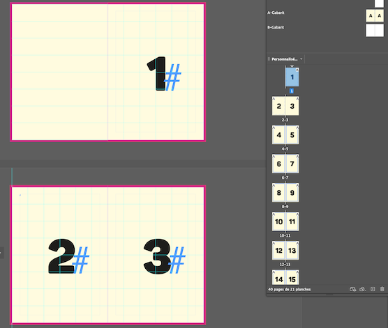
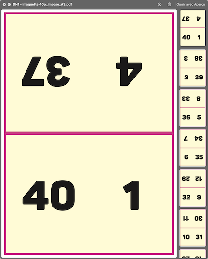

# Imposition in quarto — livret A3 (imbriqué)




## En bref

Ce projet **impose** un PDF « manuscrit » sur des feuilles **A3 portrait** : chaque feuille contient **4 pages du livret** (grille 2×2), **sans redimensionnement** (copie 1:1). Après pliage *in quarto* et imbrication des cahiers, on obtient un livret broché au dos.

- **Entrée** : un PDF au format imposé par la chaîne d’impression (voir ci-dessous).
- **Sortie** : un PDF prêt à imprimer en **recto-verso** sur A3 (`*_impose_A3.pdf`).

Le script calcule **k = nombre de pages du manuscrit ÷ 8** (nombre de feuilles A3 par côté du livre). Les tables de placement (pages + rotations) sont **générées automatiquement** (`layouts_dynamic.py`).

---

## Format du PDF manuscrit (obligatoire)

### Dimensions : **143,5 × 205 mm** par page (portrait)

Ce format correspond à la zone utile obtenue lorsque l’on tient compte à la fois :

1. **Marges non imprimables de l’imprimante A3** : **5 mm** sur chaque bord de la feuille A3 (zone imprimable réduite).
2. **Fonds perdus du livret** : **3 mm** prévus sur le livret fini (hors page utile InDesign / maquette).

La grille 2×2 remplit exactement la zone imprimable A3 avec ces contraintes : **2 × 143,5 mm = 287 mm** en largeur, **2 × 205 mm = 410 mm** en hauteur (après retrait des 5 mm de marge sur l’A3).

Le script **ne redimensionne pas** les pages : si les dimensions ne correspondent pas (à une petite tolérance près), le fichier est **refusé**.

### Nombre de pages

- **Au minimum 8 pages**, et de préférence un **multiple de 8** (8, 16, 24, 32…).
- Sinon, utilise **`--pad-blanks`** (ligne de commande), la case correspondante dans la **GUI**, ou le batch **`Imposer.command`** par défaut : des **pages blanches** sont ajoutées **en fin de livret** (le fichier source n’est pas modifié).

---

## Utilisation

### macOS — le plus simple (lot de PDF)

1. Place tes PDF manuscrits **dans le même dossier** que **`Imposer.command`** (racine du projet).
2. **Double-clic** sur **`Imposer.command`** : tous les `*.pdf` de ce dossier sont traités (sauf les `*_impose_A3.pdf` déjà générés).
3. Chaque sortie est créée à côté du fichier source : **`nom_du_fichier_impose_A3.pdf`**.

Variable optionnelle : **`INQUARTO_STRICT_PAGES=1`** pour refuser un nombre de pages non multiple de 8 (sans pages blanches).

### Interface graphique

- Ouvre **`Lancer InQuarto GUI.command`** (dans le dossier **`.inquarto/`**, visible via Finder : *Aller* → *Aller au dossier…* → `.inquarto`).
- Glisse-dépose un PDF ou choisis-le, option **pli** et **complément en multiple de 8**, puis **Imposer**.

### Ligne de commande

Depuis la racine du projet (là où se trouvent `Imposer.command` et `.inquarto/`) :

```bash
.inquarto/.venv/bin/python .inquarto/impose_quarto.py "manuscrit.pdf" "sortie_impose_A3.pdf"
```

Même dossier que le manuscrit, nom par défaut :

```bash
.inquarto/.venv/bin/python .inquarto/impose_quarto.py "manuscrit.pdf"
```

**Sans argument** : traite tous les `*.pdf` du dossier parent de `.inquarto/` (même emplacement que le double-clic sur `Imposer.command`).

**Compléter en multiple de 8** (pages blanches en fin) :

```bash
.inquarto/.venv/bin/python .inquarto/impose_quarto.py --pad-blanks "manuscrit.pdf" "sortie_impose_A3.pdf"
```

**Ordre des plis** si tu plies d’abord gauche/droite puis haut/bas :

```bash
.inquarto/.venv/bin/python .inquarto/impose_quarto.py --pli-premier bord-long "manuscrit.pdf" "sortie.pdf"
```

**Épreuve numérotée** (manuscrit de test puis imposition) :

```bash
.inquarto/.venv/bin/python .inquarto/impose_quarto.py --proof-output "test_impose_A3.pdf"
```

**Manuscrit épreuve seul** (sans imposer) :

```bash
.inquarto/.venv/bin/python .inquarto/impose_quarto.py --proof-only "epreuve.pdf" --k 4
```

(`--k` = nombre de feuilles A3 ; pages manuscrit = 8 × k.)

---

## Installation des dépendances

**Recommandé** : premier lancement via **`Imposer.command`** (création de **`.inquarto/.venv`** et installation de **`requirements.txt`** si besoin).

Manuellement :

```bash
/usr/bin/python3 -m venv .inquarto/.venv
.inquarto/.venv/bin/pip install -r .inquarto/requirements.txt
```

Si **`tkinter`** manque avec un Python Homebrew, recrée le venv avec **`/usr/bin/python3`** ou installe le paquet Tk adapté à ta version de Python.

---

## Vérification sur la feuille 1 (exemple 32 pages, k = 4)

**Recto** — en partant du **bas à droite**, ordre **BR → BL → TL → TR** : pages **1, 32, 29, 4**.

**Verso** : **TL=3, TR=30, BL=2, BR=31** (TL et TR en rotation 180° dans le PDF, BL et BR à 0°).

Si ce n’est pas le cas après un pli soigné, essaie **`--pli-premier bord-long`** ou adapte **`.inquarto/layouts_dynamic.py`**.

---

## Ordre des plis (A3 portrait) — défaut *bord court d’abord*

1. **1er pli — bords courts** : rabattre le **haut sur le bas** (pli horizontal, tu divises la hauteur 420 mm).
2. **2e pli — bords longs** : rabattre **gauche sur droite** (pli vertical, tu divises la largeur 297 mm).

---

## Atelier (papier)

Après pli *in quarto* de chaque A3 : **imbriquer** les cahiers ; **2 agrafes** au dos ; **rogner la tête** selon ta maquette.

Ordre d’imbrication (résumé) :

1. Cahier de la **dernière** feuille A3 (cœur du livre).
2. Glisser les cahiers précédents jusqu’à la **feuille 1** (couverture / fin à l’extérieur).

---

## Impression

- **Recto-verso**, retournement sur le **bord long** (*flip on long edge*) si l’imprimante le propose ainsi.
- Ordre du fichier : feuille 1 recto, feuille 1 verso, feuille 2 recto, etc.

Si le verso est décalé ou inversé, change l’option de retournement dans le pilote.

---

## Fichiers du dépôt

| Fichier | Rôle |
|--------|------|
| **`Imposer.command`** | Double-clic : batch des PDF à la racine du projet |
| **`README.md`** | Cette documentation |
| **`.inquarto/impose_quarto.py`** | Ligne de commande, validation, imposition PyMuPDF |
| **`.inquarto/layouts_dynamic.py`** | Tables d’imposition (pages + rotations) |
| **`.inquarto/in_quarto_gui.py`** | Interface graphique Tk |
| **`.inquarto/Lancer InQuarto GUI.command`** | Lance la GUI (macOS) |
| **`.inquarto/requirements.txt`** | Dépendances Python |

Pour modifier l’ordre ou les rotations après essai papier : **`.inquarto/layouts_dynamic.py`**.
